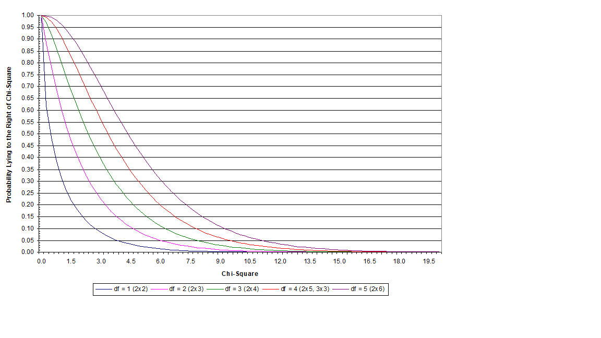

```{r setup, include=FALSE}
knitr::opts_chunk$set(echo = FALSE)

options(scipen=99)

packages<-c("tidyverse","knitr")

package.check <- lapply(
  packages,
  FUN = function(x) {
    if (!require(x, character.only = TRUE)) {
      install.packages(x, dependencies = TRUE)
      library(x, character.only = TRUE)
    }
  }
)
```

## Inference with Two Qualitative Variables

We are going to begin our discussion of statistical inference with a simple case of two qualitative variables.

As a refresher, a qualitative variable is one whose values indicate either 1) nominal categories or, 2) ordinal categories. 

In either case, comparison of means is inappropriate without an adjustment to the standard t-tests you've discussed in prior statistics classes. 

## Inference with Two Qualitative Variables - Outline

I.  Contingency Tables
II.  Steps in a Hypothesis Test
III.  Chi-Square Test of Independence
IV.  Computational Formula for $\chi^{2}$
V.  Measures of Association
VI.  Alternative Tests of Independence in 2x2 Tables

## Contingency Tables

\begin{itemize}
  \item Contingency table (a.k.a., a cross-tab). 
  \begin{itemize}
    \item Illustrates the joint distribution of two variables
    \item Defined by the \# of rows and the \# of columns (R x C)
  \end{itemize}
  \item 2 x 2 contingency table
\end{itemize}

\begin{table}
\centering
\begin{tabular}{cccc}
\hline
& $\sim X$ & $X$ & \text{Total} \\ \hline \hline
$\sim Y$ & $f_{11}$ & $f_{12}$ & $f_{1 \cdot}$ \\
$Y$ & $f_{21}$ & $f_{22}$ & $f_{2\cdot}$ \\ \hline
\text{Total} & $f_{\cdot1}$ & $f_{\cdot2}$ & $n$ \\ \hline
\end{tabular}
\end{table}

## Contingency Tables

\begin{itemize}
  \item An alternative representation
  \begin{itemize}
    \item Relative frequencies instead of frequencies
    \item Joint probabilities in the middle, unconditional probabilities on the margins
  \end{itemize}
\end{itemize}

\begin{table}
\centering
\begin{tabular}{cccc}
\hline
& $\sim X$ & $X$ & \text{Total} \\ \hline \hline
$\sim Y$ & $p_{11}$ & $p_{12}$ & $p_{1 \cdot}$ \\
$Y$ & $p_{21}$ & $p_{22}$ & $p_{2\cdot}$ \\ \hline
\text{Total} & $p_{\cdot1}$ & $p_{\cdot2}$ & $n$ \\ \hline
\end{tabular}
\end{table}

\begin{itemize}
  \item $p_{22} = p(X \cap Y)$
  \item $p_{2 \cdot} = p_{21} + p_{22} = p(\sim X \cap Y) + p(X \cap Y) = p(Y)$
\end{itemize}

## Relationship Between Two Categorical Variables

\begin{itemize}
  \item Example: juvenile and adult arrests
  
\begin{table}
\centering
\begin{tabular}{cccc}
\hline
& \multicolumn{2}{c}{\textbf{Juvenile Arrest?}} & \\
\textbf{Adult Arrest?} & $\text{No } (\sim J)$ & $\text{Yes } (J)$ & \text{Total} \\ \hline \hline
$\text{No } (\sim A)$ & $40$ & $20$ & $60$ \\
$\text{Yes } (A)$ & $10$ & $30$ & $40$ \\ \hline
\text{Total} & $50$ & $50$ & $100$ \\ \hline
\end{tabular}
\end{table}

  \item Are juvenile and adult arrests independent?
  \begin{itemize}
    \item Does knowing that someone was arrested as a juvenile help us predict whether or not they are arrested as an adult?
    \item Not necessary to be a perfect prediction - only \textit{better than chance} or \textit{more likely than not}. 
  \end{itemize}
\end{itemize}

## Conditional Probabilities

\begin{small}
\begin{table}
\centering
\begin{tabular}{cccc}
\hline
& \multicolumn{2}{c}{\textbf{Juvenile Arrest?}} & \\
\textbf{Adult Arrest?} & $\text{No } (\sim J)$ & $\text{Yes } (J)$ & \text{Total} \\ \hline \hline
$\text{No } (\sim A)$ & $40$ & $20$ & $60$ \\
$\text{Yes } (A)$ & $10$ & $30$ & $40$ \\ \hline
\text{Total} & $50$ & $50$ & $100$ \\ \hline
\end{tabular}
\end{table}
\end{small}

\begin{itemize}
  \item Are juvenile \& adult arrest independent?
  \begin{itemize}
    \item Recall the rule of independence: If $p(A \mid B) = p(A)$ or $p(B \mid A) = p(B)$ then A and B are independent. 
    \item Are J and A independent in this cross-tab?
    \begin{itemize}
      \item $p(A)=\frac{40}{100}= `r 40/100`$
      \item $p(A \mid J) = \frac{30}{50} = `r 30/50`$
    \end{itemize}
    \item Not independent - worth investigating more. 
  \end{itemize}
\end{itemize}

## Conditional Probabilities Continued

\begin{small}
\begin{table}
\centering
\begin{tabular}{cccc}
\hline
& \multicolumn{2}{c}{\textbf{Juvenile Arrest?}} & \\
\textbf{Adult Arrest?} & $\text{No } (\sim J)$ & $\text{Yes } (J)$ & \text{Total} \\ \hline \hline
$\text{No } (\sim A)$ & $40$ & $20$ & $60$ \\
$\text{Yes } (A)$ & $10$ & $30$ & $40$ \\ \hline
\text{Total} & $50$ & $50$ & $100$ \\ \hline
\end{tabular}
\end{table}
\end{small}

What is the nature of the relationship between juvenile and adult arrest?
\begin{itemize}
  \item Arrested juveniles are 200\% \textbf{more likely} to be arrested as an adult than non-arrested juveniles. 
  \begin{itemize}
    \item $p(A \mid J) = \frac{30}{50} = `r 30/50`$
    \item $p(A \mid \sim J) = \frac{10}{50} = `r 10/50`$
  \end{itemize}
  \item \% difference = $\frac{0.60-0.20}{0.20}*100 = 200.0\%$
\end{itemize}

## Setting Up a Hypothesis Test

Now it's time to introduce you to the formal way to set up a hypothesis test. 

A formal hypothesis test includes five steps:

1) Formally state your hypotheses
2) Choose a probability distribution
3) Make decision rules
4) Compute test statistic
5) Make a decision about the null hypothesis

## Step 1. Formally State Hypotheses

Two hypotheses are stated here:

1) The Alternative Hypothesis ($H_{A}$ or $H_{1}$)
2) The Null Hypothesis ($H_{0}$)

The former is your hypothesis for the test and, depending upon the test being conducted, can be directional or non-directional. 

The latter is the antithesis of the alternative hypothesis, and reflects either a) no effect or, b) an effect in the opposite direction as expected in $H_{A}$. 

## Step 2. Choose Probability Distribution

There are numerous probability distributions we will use throughout this class. This is the step where you identify that distribution. 

These distributions are often dependent upon the degrees of freedom of your test. 

Lower degrees of freedom = wider distributions, generally. This make it *more difficult* to reject the null hypothesis. 

## Step 3. Make Decision Rules

This is where you select your alpha level and identify its associated critical score for your test statistic. 

The alpha level is the degree to which you will tolerate falsely rejecting a true null hypothesis. Standard levels include .05 (5 times in 100), .01 (1 time in 100), and .001 (1 time in 1000).

A **critical score** is merely the value of the test statistic at that alpha level. Any value exceeding that occurs in the **critical region** where you will reject the null hypothesis. 

## Step 4. Compute Test Statistic

Here is where you apply the formula specific to that probability distribution.

Your result can then be plotted on this probability distribution and you can determine the probability that you would expect a result like that is the null hypothesis were true. 

## Step 5. Make a Decision About $H_{0}$

If the test statistic falls within the **critical region** this indicates that the probability of finding a test statistic of that size or larger (given the null hypothesis is true) is smaller than your alpha level. 

The language in this step is always in reference to the null hypothesis - we either accept it or we reject it. 

The conclusion must be tailored to your hypothesis. Directional and non-directional hypotheses will result in differently worded conclusions. 

## Hypothesis Testing Errors

In hypothesis testing, there are two types of error that we must be aware of. A type I error (**false positive**) is when we reject the null hypothesis, but in fact it is true. A type II error (**false negative**) is when we accept the null hypothesis, but it in fact is false. 

\begin{table}[ht]
\centering
\begin{tabular}{lcc}
\hline
& \multicolumn{2}{c}{Decision} \\
Reality & Accept $H_{0}$ & Reject $H_{0}$ \\ \hline \hline
$H_{0}$ is true & Correct decision & Type I Error ($\alpha$) \\
$H_{0}$ is false & Type II Error ($\beta$) & Correct decision \\ \hline
\end{tabular}
\end{table}

We can reduce the probability of a type I error by decreasing level of significance. However, if we decrease the probability of falsely rejecting the null hypothesis (say 0.001), we necessarily increase the probability of falsely accepting the null hypothesis. 

## Chi-Square ($\chi^{2}$) Test of Independence 

\begin{itemize}
  \item Formal test of whether two categorical (N,O) variables are \textbf{statistically independent}.
  \begin{itemize}
    \item Compare \textit{observed} frequencies with \textit{expected}
    \item $\chi^{2}$ relies on the multiplication rule for independent events
    \begin{itemize}
      \item $p(A \cap B) = p(A) * p(B)$
    \end{itemize}
  \end{itemize}
  \item How much does our contingency table depart from what we would \textbf{expect} if the two variables were truly independent?
\end{itemize}

## Chi-Square ($\chi^{2}$) Test of Independence 

Formula for ($\chi^{2}$): $$\chi^{2} = \sum^{k}_{k=1} \frac{(f_{obs} - f_{exp})^{2}}{f_{exp}}$$

Where: 
1) $f$ represents *frequency*
2) $f_{obs}$ is *observed frequency*
3) $f_{exp}$ is *expected frequency*
4) and $k$ is the total number of cells in the table

$\chi^{2}$ is associated with its own probability distribution (refer to the appendix in your textbook). 

The table is organized by **degrees of freedom** which is calculated as follows: $$df = (\# \text{ rows}-1)*(\# \text{ columns}-1)$$

## Chi-Square Probability Distribution

\begin{itemize}
  \item Probability function for $\chi^{2}$ (don't freak out - you don't have to compute this): $$p(x)=\frac{(1/2)^{(k/2)}}{\Gamma (k/2)}x^{k/(2-1)}e^{-x/2}$$
  \item $x$ represents a given $\chi^{2}$ value that you want to know the probability of
  \item $k$ represents the \textbf{degrees of freedom}
  \item $\Gamma(\cdot)$ represents the \textbf{gamma} function
  \begin{itemize}
    \item An extension of the factorial function (e.g., $z!$) to non-integer and complex numbers
  \end{itemize}
\end{itemize}

## Chi-Square Probability Distribution



## Chi-Square Probability Distribution - Critical Values

A **critical value** is the value of some probability distribution statistic where we are comfortable calling the result *unlikely* enough to be statistically **significant**.

You can find the full version of the table below in your text's appendix. 

\begin{table}
\centering
\begin{tabular}{ccccc}
\hline
& \multicolumn{4}{c}{\textbf{Significance Level ($\alpha$)}} \\
\textbf{Degrees of Freedom} & .10 & .05 & .01 & .001 \\ \hline \hline
1 & 2.706 & 3.841 & 6.635 & 10.827 \\
2 & 4.605 & 5.991 & 9.210 & 13.815 \\
3 & 6.251 & 7.815 & 11.341 & 16.268 \\
4 & 7.779 & 9.448 & 13.277 & 18.465 \\
5 & 9.236 & 11.070 & 15.086 & 20.517 \\ \hline
\end{tabular}
\end{table}

## Alternative Method to Find the Chi-Square Critical Value

An easy way to identify the $\chi^{2}$ critical value is to use the qchisq() function in R. 

The qchisq() function takes the following general form:

qchisq(p, df, lower.tail=FALSE)

Where *p* is your alpha level (.05, .01, or .001), *df* is your degrees of freedom, and lower.tail=FALSE tells R to return the $\chi^{2}$ value necessary to reject the null hypothesis (i.e., the value that separates out .05 probability points at or above it).

## Juvenile & Adult Arrest Hypothesis Test

\begin{itemize}
  \item Research Question
  \begin{itemize}
    \item Is juvenile arrest a predictor of adult arrest?
  \end{itemize}
  \item Step 1) Formally state hypotheses
  \begin{itemize}
    \item Hypotheses stated in terms of $\chi^{2}$
    \begin{itemize}
      \item Under $H_{0}$, $f_{obs} = f_{exp}$, so $\chi^{2}$ will be zero
      \item Under $H_{1}$, $f_{obs} \ne f_{exp}$, so $\chi^{2}$ will be positive
      \item Note - you cannot do a directional (one-tailed) significance test with $\chi^{2}$
    \end{itemize}
  \end{itemize}
\end{itemize}

$$H_{1}: \chi^{2} > 0$$
$$H_{0}: \chi^{2} = 0$$

## Juvenile & Adult Arrest Hypothesis Test

\begin{itemize}
  \item Step 2. Choose a probability distribution
  \begin{itemize}
    \item $\chi^{2}$ distribution
    \item $df = (\# \text{rows} - 1)*(\# \text{columns} - 1) = (2-1)*(2-1) = 1$
  \end{itemize}
\end{itemize}

## Juvenile & Adult Arrest Hypothesis Test

\begin{itemize}
  \item Step 3. Make decision rules (refer to table above or in the text appendix)
  \begin{itemize}
    \item $\alpha=.05$ (I will always provide this for you)
    \item $\chi^{s}_{crit} = 3.841$
    \item Reject $H_{0}$ if the test statistic (TS) > 3.841
  \end{itemize}
\end{itemize}

\small

*I took this critical value from a table, but could also find it using the following code in inline code (within grave accents)*:

r qchisq(.05, 1, lower.tail=FALSE)

## Juvenile & Adult Arrest Hypothesis Test

\begin{itemize}
  \item Compute the test statistic
  
  \begin{small}
  \begin{table}
  \centering
  \begin{tabular}{cccc}
  \hline
  & \multicolumn{2}{c}{\textbf{Juvenile Arrest?}} & \\
  \textbf{Adult Arrest?} & $\text{No } (\sim J)$ & $\text{Yes } (J)$ & \text{Total} \\ \hline \hline
  $\text{No } (\sim A)$ & $40$ & $20$ & $60$ \\
  $\text{Yes } (A)$ & $10$ & $30$ & $40$ \\ \hline
  \text{Total} & $50$ & $50$ & $100$ \\ \hline
  \end{tabular}
  \end{table}
  \end{small}
  
  \item Get expected frequencies (should sum to n): $f_{exp} = \frac{RM*CM}{n}$
  
  \begin{small}
  \begin{table}
  \centering
  \begin{tabular}{ccc}
  \hline
  Cell & $f_{obs}$ & $f_{exp}$ \\ \hline \hline
  11 & 40 & $(60*50)/100 = `r (60*50)/100`$ \\
  12 & 20 & $(60*50)/100 = `r (60*50)/100`$ \\
  21 & 10 & $(40*50)/100 = `r (40*50)/100`$ \\
  22 & 30 & $(40*50)/100 = `r (40*50)/100`$ \\ \hline
  & 100 & 100 \\ \hline
  \end{tabular}
  \end{table}
  \end{small}
  
\end{itemize}

## Juvenile & Adult Arrest Hypothesis Test

\begin{itemize}
  \item Compute test statistic (continued)
  \begin{itemize}
    \item We now have two different contingency tables:
    \begin{itemize}
      \item One showing the \textbf{observed} relationship between A \& J
      \item One showing the \textbf{expected} relationship between A \& J where the are independent by construction. 
    \end{itemize}
  \end{itemize}
\end{itemize}

\begin{footnotesize}
\begin{columns}
\begin{column}{0.5\textwidth}
\begin{table}
\centering
\begin{tabular}{cccc}
\hline
\multicolumn{4}{c}{\textbf{Observed Cross-Tab}} \\ \hline
& \multicolumn{2}{c}{\textbf{Juvenile Arrest?}} & \\
\textbf{Adult Arrest?} & $\text{No } (\sim J)$ & $\text{Yes } (J)$ & \text{Total} \\ \hline \hline
$\text{No } (\sim A)$ & $40$ & $20$ & $60$ \\
$\text{Yes } (A)$ & $10$ & $30$ & $40$ \\ \hline
\text{Total} & $50$ & $50$ & $100$ \\ \hline
\end{tabular}
\end{table}
$p(A) = .40$

$p(A \mid J) = .60$
\end{column}

\begin{column}{0.5\textwidth}
\begin{table}
\centering
\begin{tabular}{cccc}
\hline
\multicolumn{4}{c}{\textbf{Expected Cross-Tab}} \\ \hline
& \multicolumn{2}{c}{\textbf{Juvenile Arrest?}} & \\
\textbf{Adult Arrest?} & $\text{No } (\sim J)$ & $\text{Yes } (J)$ & \text{Total} \\ \hline \hline
$\text{No } (\sim A)$ & $30$ & $30$ & $60$ \\
$\text{Yes } (A)$ & $20$ & $20$ & $40$ \\ \hline
\text{Total} & $50$ & $50$ & $100$ \\ \hline
\end{tabular}
\end{table}
$p(A) = .40$

$p(A \mid J) = .40$
\end{column}
\end{columns}
\end{footnotesize}

## Juvenile & Adult Arrest Hypothesis Test

\begin{itemize}
  \item Compute the test statistic (continued)
  \begin{itemize}
    \item Compute the $\chi^{2}$ statistic
  \end{itemize}
\end{itemize}

$$\chi^{2} = \sum \frac{(f_{obs}-f_{exp})^{2}}{f_{exp}}$$

\begin{table}
\centering
\begin{tabular}{cccccc}
Cell & $f_{obs}$ & $f_{exp}$ & $f_{obs}-f_{exp}$ & $(f_{obs}-f_{exp})^{2}$ & $(f_{obs}-f_{exp})^{2}/ f_{exp}$ \\ \hline \hline
11 & 40 & 30 & 10 & 100 & 3.33 \\
12 & 20 & 30 & -10 & 100 & 3.33 \\
21 & 10 & 20 & -10 & 100 & 5.00 \\
22 & 30 & 20 & 10 & 100 & 5.00 \\ \hline
& 100 & 100 & & & 16.66\\ \hline
\end{tabular}
\end{table}

## Step 4: R Method - via creating data in R

\scriptsize

```{r juv_adult_arr, echo=TRUE}
cell<-c("11","12","21","22") # create character variable to indicate cell positions
obs<-c(40,20,10,30) # input observed frequencies
exp<-c((60*50)/100,(60*50)/100,(40*50)/100,(40*50)/100) # calculate expected frequencies
dev<-obs-exp # compute differences
dev_sq<-dev^2 # square the differences
chi<-dev_sq/exp # divide differences by expected frequencies
chi2<-sum(chi) # sum chi2 values for individual cells
chi2 # print out chi square value
```

## Step 4: Automatic Method

\scriptsize

```{r auto_chi2, echo=TRUE}
juv_adult_arr<-matrix(c(40,10,20,30),ncol=2) # column values in pairs 
# (top to bottom, left to right)
chisq.test(juv_adult_arr, correct=FALSE)# run chi-square test
```

The *correct=FALSE* part is required to suppress a test correction that makes it harder to reject the null hypothesis. Normally, it is best to leave that as correct=TRUE in practice but for this example I wanted the $\chi^{2}$ to be the same across all examples. 

You cannot use this method for submitting your work, but can use it to check your math!

## Juvenile & Adult Arrest Hypothesis Test

\begin{itemize} 
  \item Step 4. Compute the test statistic (continued):
  \begin{itemize}
    \item $TS = 16.66$
  \end{itemize}
  \item Step 5. Make a decision about the null hypothesis
  \begin{itemize}
    \item Reject $H_{0}$
  \end{itemize}
  \item Conclusion?
  \begin{itemize}
    \item There is a significant relationship between juvenile arrest \& adult arrest. 
    \item Or, juvenile arrest \& adult arrest are not independently distributed. 
  \end{itemize}
\end{itemize}

## A Comment on Interpretation of Step 5. 

\begin{itemize}
  \item What does it mean to reject the null hypothesis of no relationship between juvenile \& adult arrest?
  \begin{itemize}
    \item \textbf{Does not} mean that all (or even most) people arrested as juveniles will be arrested as adults. 
    \item Only means that people arrested as juveniles are \textbf{more likely} to be arrested as adults than if they had not been arrested as juveniles.
  \end{itemize}
  \item Does not imply causality, either!
  \begin{itemize}
    \item This result only confirms a statistical association exists between the two variables. 
  \end{itemize}
\end{itemize}

## Military Service and Drug Use

\begin{small}
\begin{table}
\centering
\begin{tabular}{lccc}
\hline
& \multicolumn{2}{c}{\textbf{Military Service?}} & \\
\textbf{Use Drugs?} & No ($\sim M$) & Yes ($M$) & Total \\ \hline \hline
No ($\sim D$) & 3426 & 407 & 3833 \\
Yes ($D$) & 629 & 108 & 737 \\ \hline
Total & 4055 & 515 & 4570 \\ \hline
\end{tabular}
\end{table}
\end{small}

\begin{itemize}
  \item Are drug use \& military service independent?
  \begin{itemize}
    \item $p(D) = \frac{737}{4570} = `r format(737/4570, scientific=F, digits=3)`$
    \item $p(D \mid M) = \frac{108}{515} = `r format(108/515, scientific=F, digits=3)`$
  \end{itemize}
  \item Research Question
  \begin{itemize}
    \item Is there a relationship between military service \& drug use?
  \end{itemize}
\end{itemize}

## Military Service and Drug Use - Hypothesis Test

\begin{itemize}
  \item Step 1: Formally state hypothesis
  \begin{itemize}
    \item $H_{1}: \chi^{2}>0$
    \item $H_{0}: \chi^{2}=0$
  \end{itemize}
  \item Step 2: Choose a probability distribution
  \begin{itemize}
    \item $\chi^{2}$ distribution
    \item $df = (2-1)*(2-1) = 1$
  \end{itemize}
  \item Step 3: Make decision rules
  \begin{itemize}
    \item $\alpha$ = .01
    \item $\chi^{2}_{crit} = 6.635$
    \item Reject $H_{0}$ if TS > 6.635
  \end{itemize}
\end{itemize}

## Military Service and Drug Use - Hypothesis Test

\begin{itemize}
  \item Step 4: Compute test statistic

\begin{small}
\begin{table}
\centering
\begin{tabular}{cccc}
\hline
Cell & $f_{obs}$ & $f_{exp}$ & $(f_{obs}-f_{exp})^{2}/f_{exp}$ \\ \hline \hline
11 & 3426 & $(3833*4055)/4570 = `r format((3833*4055)/4570, digits=3, nsmall=2)`$ & 0.18 \\
12 & 407 & $(3833*515)/4570 = `r format((3833*515)/4570, digits=3, nsmall=2)`$ & 1.44 \\
21 & 629 & $(737*4055)/4570 = `r format((737*4055)/4570, digits=3, nsmall=2)`$ & 0.95 \\
22 & 108 & $(737*515)/4570 = `r format((737*515)/4570, digits=3, nsmall=2)`$ & 7.50 \\ \hline
& 4570 & 4570.00 & 10.07 \\ \hline
\end{tabular}
\end{table}
\end{small}

  \item Step 5: Make a decision about the null hypothesis
  \begin{itemize}
    \item TS = 10.07
    \item Conclusion? Reject $H_{0}$, conclude that military service and drug use are \textbf{not} independent of one another. 
  \end{itemize}
\end{itemize}

## Computational Formula for $\chi^{2}$

\begin{itemize}
  \item Computational formula: $$\chi^{2}= \left( \sum^{k}_{k=1} \frac{f^{2}_{obs}}{f_{exp}} \right) -n$$
  \item An advantage is that this formula does not require you to compute squared deviations
  \item \textbf{Caution}: Do not forget to subtract off $n$
\end{itemize}

## Employment \& Delinquency - Hypothesis Test

\begin{small}
\begin{table}[h]
\centering
\begin{tabular}{lcccc}
\hline
& \multicolumn{3}{c}{Employment Status} & \\
Delinquent Acts & 0 Hours & 1-20 Hours  & 21+ Hours & Total \\ \hline
0 & 3642 & 1605 & 1441 & 6688  \\
1 - 4 & 637 & 374 & 427 & 1438  \\
5+ & 318 & 201 & 289 & 808 \\ \hline
Total & 4597 & 2180 & 2157 & 8934  \\ \hline
\end{tabular}
\end{table}
\end{small}

\begin{small}
\begin{itemize}
  \item Research question: Is employment associated with delinquency?
  \item \textbf{Step 1}: Formally state hypothesis
  \begin{itemize}
    \item $H_{1}: \chi^{2}>0$
    \item $H_{0}: \chi^{2}=0$
  \end{itemize}
\end{itemize}
\end{small}


## Employment \& Delinquency - Hypothesis Test

\begin{small}
\begin{table}[h]
\centering
\begin{tabular}{lcccc}
\hline
& \multicolumn{3}{c}{Employment Status} & \\
Delinquent Acts & 0 Hours & 1-20 Hours  & 21+ Hours & Total \\ \hline
0 & 3642 & 1605 & 1441 & 6688  \\
1 - 4 & 637 & 374 & 427 & 1438  \\
5+ & 318 & 201 & 289 & 808 \\ \hline
Total & 4597 & 2180 & 2157 & 8934  \\ \hline
\end{tabular}
\end{table}
\end{small}

\begin{small}
\begin{itemize}
  \item \textbf{Step 2}: Choose a probability distribution
  \begin{itemize}
    \item $\chi^{2}$ distribution
    \item $df = (3-1)*(3-1) = 4$
  \end{itemize}
  \item \textbf{Step 3}: Make decision rules
  \begin{itemize}
    \item $\alpha$ = .001
    \item $\chi^{2}_{crit} = 18.465$
    \item Reject $H_{0}$ if TS > 18.465
  \end{itemize}
\end{itemize}
\end{small}

## Employment \& Delinquency - Hypothesis Test

\begin{itemize}
  \item \textbf{Step 4}: Calculate the test statistic

\begin{table}[h]
\centering
\begin{tabular}{cccc}
\hline
Cell  & $f_{\text{obs}}$  & $f_{\text{exp}}$ & $f_{\text{obs}}^{2}/f_{\text{exp}}$ \\ \hline
1 & 3642 & 3441.32 & 3854.38 \\
2 & 1605 & 1631.95 & 1578.50 \\
3 & 1714 & 1614.73 & 1285.96 \\
4 & 1524 & 739.92 & 548.40 \\
5 & 1179 & 350.89 & 398.63 \\
6 & 671 & 347.19 & 525.16 \\
7 & 221 & 415.76 & 243.23 \\
8 & 109 & 197.16 & 204.91 \\
9 & 8604 & 195.08 & 428.14 \\ \hline
  & 8934 & 8934.00 & 9067.31 \\ \hline    
\end{tabular}
\end{table}

\end{itemize}

## Employment \& Delinquency - Hypothesis Test

\begin{small}
\begin{table}[h]
\centering
\begin{tabular}{lcccc}
\hline
& \multicolumn{3}{c}{Employment Status} & \\
Delinquent Acts & 0 Hours & 1-20 Hours  & 21+ Hours & Total \\ \hline
0 & 3642 & 1605 & 1441 & 6688  \\
1 - 4 & 637 & 374 & 427 & 1438  \\
5+ & 318 & 201 & 289 & 808 \\ \hline
Total & 4597 & 2180 & 2157 & 8934  \\ \hline
\end{tabular}
\end{table}
\end{small}

\begin{itemize}
  \item \textbf{Step 5}: TS = 9067.31-8934 = 133.31
  \item Conclusion? Reject $H_{0}$, conclude that employment and delinquency are \textbf{not} independent. 
\end{itemize}

## Measures of Association

\begin{itemize}
  \item A chi-square test will provide an answer as to whether the relationship between two variables is \textbf{statistically significant}
  \begin{itemize}
    \item But...The test says nothing about whether the relationship is \textbf{substantively significant}
  \end{itemize}
  \item Measures of association inform us about the strength of the relationship
  \begin{itemize}
    \item Ex., How strong is the relationship between juvenile \& adult arrest, or between military service \& drug use?
  \end{itemize}
\end{itemize}

## Measures of Association

MOA #1: Phi ($\phi$) - only applicable to 2x2 tables

$$\displaystyle \phi=\sqrt{\frac{\chi^{2}}{\text{n}}}$$

If you square the value of $\phi$ you can interpret this statistic as the percentage of the variance in one variable that may be explained by the other. 

## Measures of Association

MOA #2: Contingency ($C$) - works for any size table. 

$$\displaystyle C =\sqrt{\frac{\chi^{2}}{\text{n} + \chi^{2}}}$$

MOA #3: Cramer's V ($V$) - works for any size table

$$\displaystyle V=\sqrt{\frac{\chi^{2}}{n \text{ * } \text{min}(r-1,c-1)}}$$

Where $r$ is rows, $c$ is columns, and $min(r-1, c-1)$ returns the smaller number of the two. 

## Measures of Association

MOA #4: Lambda ($\lambda$)

$$\displaystyle \lambda=\sqrt{\frac{(\sum{f_{IV})-f_{DV}}}{\text{n}-f_{DV}}}$$

Where $f_{IV}$ are the largest $f$'s in each category of the independent variable, and $f_{DV}$ is the largest marginal of the dependent variable.

## Measures of Association

\begin{itemize}
  \item Useful rule for interpreting measures of association (except Lambda)
  \begin{itemize}
    \item 0.00 to 0.29 = Weak relationship
    \item 0.30 to 0.59 = Moderate relationship
    \item 0.60 to 1.00 = Strong relationship
  \end{itemize}
  \item M.O.A.’s for ordinal variables can also be positive or negative
  \begin{itemize}
    \item Closer to 0.0 $\Rightarrow$ Weaker relationship
    \item Closer to +1.0 $\Rightarrow$ Stronger positive relationship
    \item Closer to –1.0 $\Rightarrow$ Stronger negative relationship
  \end{itemize}
\end{itemize}

## Measures of Association - Juvenile \& Adult Arrest

\begin{small}
\begin{table}
\centering
\begin{tabular}{cccc}
\hline
& \multicolumn{2}{c}{\textbf{Juvenile Arrest?}} & \\
\textbf{Adult Arrest?} & $\text{No } (\sim J)$ & $\text{Yes } (J)$ & \text{Total} \\ \hline \hline
$\text{No } (\sim A)$ & $40$ & $20$ & $60$ \\
$\text{Yes } (A)$ & $10$ & $30$ & $40$ \\ \hline
\text{Total} & $50$ & $50$ & $100$ \\ \hline
\end{tabular}
\end{table}
\end{small}

\begin{columns}
\begin{column}{0.50\textwidth}

$$\phi = \sqrt{\frac{\chi^{2}}{n}} = \sqrt{\frac{16.667}{100}} = `r round(sqrt(16.667/100),3)`$$
$$V=\sqrt{\frac{\chi^{2}}{n \text{ * } \text{min}(r-1,c-1)}} = \sqrt{\frac{16.667}{100*(2-1)}} = `r round(sqrt(16.667/(100*(2-1))),3)`$$
\end{column}

\begin{column}{0.50\textwidth}
$\phi$ and Cramer's $V$ will always produce the same answer in a 2x2 table. 
\end{column}
\end{columns}

## Measures of Association - Juvenile \& Adult Arrest

\begin{small}
\begin{table}
\centering
\begin{tabular}{cccc}
\hline
& \multicolumn{2}{c}{\textbf{Juvenile Arrest?}} & \\
\textbf{Adult Arrest?} & $\text{No } (\sim J)$ & $\text{Yes } (J)$ & \text{Total} \\ \hline \hline
$\text{No } (\sim A)$ & $40$ & $20$ & $60$ \\
$\text{Yes } (A)$ & $10$ & $30$ & $40$ \\ \hline
\text{Total} & $50$ & $50$ & $100$ \\ \hline
\end{tabular}
\end{table}
\end{small}

\begin{columns}
\begin{column}{0.70\textwidth}
$$C =\sqrt{\frac{\chi^{2}}{\text{n} + \chi^{2}}} = \sqrt{\frac{16.667}{100+16.667}} = `r round(sqrt(16.667/(100+16.667)),3)`$$

$$\lambda=\sqrt{\frac{(\sum{f_{IV})-f_{DV}}}{\text{n}-f_{DV}}} = \sqrt{\frac{(40+30)-60}{100-60}} = `r round(sqrt(((40+30)-60)/(100-60)),3)`$$
\end{column}

\begin{column}{0.30\textwidth}

$\lambda$ is a measure of proportionate reduction in error (PRE), telling us how better we can predict the DV using information about the IV. 

\end{column}
\end{columns}

## Measures of Association - Military Service \& Drug Use

\begin{small}
\begin{table}
\centering
\begin{tabular}{lccc}
\hline
& \multicolumn{2}{c}{\textbf{Military Service?}} & \\
\textbf{Use Drugs?} & No ($\sim M$) & Yes ($M$) & Total \\ \hline \hline
No ($\sim D$) & 3426 & 407 & 3833 \\
Yes ($D$) & 629 & 108 & 737 \\ \hline
Total & 4055 & 515 & 4570 \\ \hline
\end{tabular}
\end{table}
\end{small}

$$V=\sqrt{\frac{\chi^{2}}{n \text{ * } \text{min}(r-1,c-1)}} = \sqrt{\frac{10.068}{4570*(2-1)}} = `r round(sqrt(10.068/(4570*(2-1))),3)`$$

## Measures of Association - Military Service \& Drug Use

\begin{small}
\begin{table}
\centering
\begin{tabular}{lccc}
\hline
& \multicolumn{2}{c}{\textbf{Military Service?}} & \\
\textbf{Use Drugs?} & No ($\sim M$) & Yes ($M$) & Total \\ \hline \hline
No ($\sim D$) & 3426 & 407 & 3833 \\
Yes ($D$) & 629 & 108 & 737 \\ \hline
Total & 4055 & 515 & 4570 \\ \hline
\end{tabular}
\end{table}
\end{small}

$$C =\sqrt{\frac{\chi^{2}}{\text{n} + \chi^{2}}} = \sqrt{\frac{10.068}{4570+10.068}} = `r round(sqrt(10.068/(4570+10.068)),3)`$$

$$\lambda=\sqrt{\frac{(\sum{f_{IV})-f_{DV}}}{\text{n}-f_{DV}}} = \sqrt{\frac{(3426+407)-3833}{4570-3833}} = `r round(sqrt(((3426+407)-3833)/(4570-3833)),3)`$$

## Employment and Delinquency Example

\begin{small}
\begin{table}[ht]
\centering
\begin{tabular}{lcccc}
\hline
& \multicolumn{3}{c}{Employment Status} & \\
Delinquent Acts & 0 Hours & 1-20 Hours  & 21+ Hours & Total \\ \hline
0 & 3642 & 1605 & 1441 & 6688  \\
1 - 4 & 637 & 374 & 427 & 1438  \\
5+ & 318 & 201 & 289 & 808 \\ \hline
Total & 4597 & 2180 & 2157 & 8934  \\ \hline
\end{tabular}
\end{table}
\end{small}

$$V=\sqrt{\frac{\chi^{2}}{n \text{ * } \text{min}(r-1,c-1)}} = \sqrt{\frac{133.31}{8934*(3-1)}} = `r round(sqrt(133.31/(8934*(3-1))),3)`$$

$$C =\sqrt{\frac{\chi^{2}}{\text{n} + \chi^{2}}} = \sqrt{\frac{133.31}{8934+133.31}} = `r round(sqrt(133.31/(8934+133.31)),3)`$$

## Employment and Delinquency Example

\begin{small}
\begin{table}[ht]
\centering
\begin{tabular}{lcccc}
\hline
& \multicolumn{3}{c}{Employment Status} & \\
Delinquent Acts & 0 Hours & 1-20 Hours  & 21+ Hours & Total \\ \hline
0 & 3642 & 1605 & 1441 & 6688  \\
1 - 4 & 637 & 374 & 427 & 1438  \\
5+ & 318 & 201 & 289 & 808 \\ \hline
Total & 4597 & 2180 & 2157 & 8934  \\ \hline
\end{tabular}
\end{table}
\end{small}

$$\lambda=\sqrt{\frac{(\sum{f_{IV})-f_{DV}}}{\text{n}-f_{DV}}} = \sqrt{\frac{(3642+1605+1441)-6688}{8934-6688}} = `r round(sqrt(((3642+1605+1441)-6688)/(8934-6688)),3)`$$

## An Alternative Test of Independence in 2x2 Tables

\begin{itemize}
  \item A z-test for two sample proportions

$$\displaystyle z = \frac{p_{1}-p_{2}}{\sqrt{\pi * (1-\pi)}*\sqrt{\frac{n_{1}+n_{2}}{n_{1}*n_{2}}}}$$

  \begin{itemize}
    \item $\pi$ is the \textbf{unconditional} probability of an event for the entire sample
    \item $p_{1}$ and $p_{2}$ are the \textbf{conditional} probabilities for the two subsamples of interest
    \item $n_{1}$ and $n_{2}$ are the number of cases in the two subsamples (i.e., column totals)
  \end{itemize}
\end{itemize}

## An Alternative Test of Independence in 2x2 Tables

Probability distribution for $z$ is shown in the appendix of your text, but use this one instead for now. 

\begin{table}
\centering
\begin{tabular}{lcccc}
& \multicolumn{4}{c}{Significance Level ($\alpha$)} \\
& .10   & .05   & .01   & .001  \\ \hline
One-tailed test & 1.282 & 1.645 & 2.326 & 3.090 \\
Two-tailed test & 1.645 & 1.960 & 2.576 & 3.291 \\
\end{tabular}
\end{table}

The advantage of using $z$ over $\chi^{2}$ is that we can test \textbf{directional hypotheses}. 

We will give more formal treatment to the $z$ distribution in an upcoming lecture. 

## A $z$-test for Two Proportions - Juvenile \& Adult Arrest

\begin{small}
\begin{table}
\centering
\begin{tabular}{cccc}
\hline
& \multicolumn{2}{c}{\textbf{Juvenile Arrest?}} & \\
\textbf{Adult Arrest?} & $\text{No } (\sim J)$ & $\text{Yes } (J)$ & \text{Total} \\ \hline \hline
$\text{No } (\sim A)$ & $40$ & $20$ & $60$ \\
$\text{Yes } (A)$ & $10$ & $30$ & $40$ \\ \hline
\text{Total} & $50$ & $50$ & $100$ \\ \hline
\end{tabular}
\end{table}
\end{small}

\begin{itemize}
  \item Let's try the $z$-test:
  \begin{itemize}
    \item \textbf{Unconditional probability} of arrest as an adult
    \begin{itemize}
      \item $\pi = p(A) = 40/100 = 0.40$
    \end{itemize}
    \item \textbf{Conditional probabilities} of arrest as an adult
    \begin{itemize}
      \item $p_{J} = p(A \mid J) = 30/50 = 0.60$
      \item $p_{\sim J} = p(A \mid \sim J) = 10/50 = 0.20$
    \end{itemize}
  \end{itemize}
\end{itemize}  

## A $z$-test for Two Proportions - Juvenile \& Adult Arrest

\begin{itemize}
  \item \textbf{Step 1}: Formally state hypotheses
  \begin{itemize}
    \item Hypotheses stated in terms of $\pi$, the population probability of arrest as an adult
    \item Under $H_{1}$, adult arrest is more likely when a juvenile arrest ($J$) has occurred than when it has not ($\sim J$). 
    $$H_{1}: \pi_{J} > \pi_{\sim J}$$ $$H_{0}: \pi_{J} \le \pi_{\sim J}$$
    \item Notice that this is a directional test. Specifically, a \textit{right-tailed} test. How would we have written it if we wanted a \textit{left-tailed} test instead?
  \end{itemize}
\end{itemize}

## A $z$-test for Two Proportions - Juvenile \& Adult Arrest

\begin{itemize}
  \item \textbf{Step 2}: Choose a probability distribution
  \begin{itemize}
    \item $z$ distribution
  \end{itemize}
  \item \textbf{Step 3}: Make decision rules (refer to table)
  \begin{itemize}
    \item $\alpha$ = 0.05 (one-tailed)
    \item $z_{crit}$ = 1.645
    \item Reject $H_{0}$ if TS > 1.645
  \end{itemize}
\end{itemize}

## A $z$-test for Two Proportions - Juvenile \& Adult Arrest

\begin{itemize}
  \item \textbf{Step 4}: Compute the test statistic
  
  $$\displaystyle z = \frac{p_{1}-p_{2}}{\sqrt{\pi * (1-\pi)}*\sqrt{\frac{n_{1}+n_{2}}{n_{1}*n_{2}}}} = \frac{0.6 - 0.2}{\sqrt{.4*.6}*\sqrt{\frac{50+50}{2500}}}=\frac{0.4}{0.0980} = 4.08$$
  
  \item \textbf{Step 5}: Make a decision about the null hypothesis
  \begin{itemize}
    \item Reject $H_{0}$, conclude that the probability of adult arrest is significantly \textit{higher} if you are arrested as a juvenile. 
  \end{itemize}
\end{itemize}

## A $z$-test for Two Proportions - Juvenile \& Adult Arrest

\begin{itemize}
  \item The fact that we obtained the test statistic we did is not a coincidence
  \begin{itemize}
    \item $z = 4.08$ (from the $z$ test)
    \item $\chi^{2} = 16.66$ (from $\chi^{2}$ test)
    \item Notice - $4.08 = \sqrt{16.66}$, or $16.66 = 4.08^{2}$
  \end{itemize}
  \item $\chi^{2}$ and $z$ are very closely related
  \begin{itemize}
    \item Your conclusion from a $\chi^{2}$ test will be equivalent to conducting a two-tailed $z$ test. 
    \item A $z$ test has the added flexibility of allowing us to do one-tailed tests. 
  \end{itemize}
\end{itemize}

## Two Questions

\begin{center}
\huge Time for your two questions!
\end{center}
```{r lotr_goodbye, echo=FALSE, fig.align='center', out.height='50%', out.width='100%'}

```
